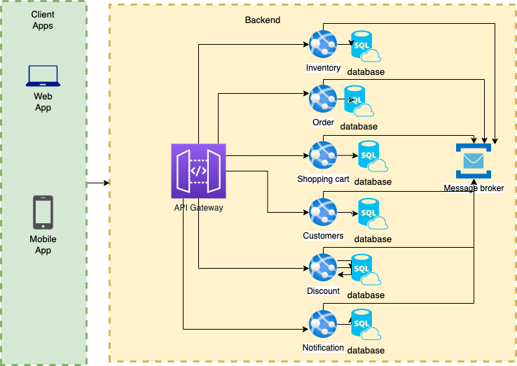

# eCommerce REST API using Spring Boot

Welcome to the eCommerce REST API built with Spring Boot. 
This API allows you to manage various aspects of an online store, including products, customers, orders, and more.

## Table of Contents

- [High-level architecture of the microservices](#High-level architecture of the microservices)
- [Getting Started](#getting-started)
- [Prerequisites](#prerequisites)
- [Installation](#installation)
- [Usage](#usage)
- [Endpoints](#endpoints)

## High-level architecture of the microservices


## Getting Started

These instructions will help you set up and run the eCommerce API on your local machine for development and testing purposes.

## Prerequisites

- [Java Development Kit (JDK) 17](https://docs.aws.amazon.com/corretto/latest/corretto-17-ug/downloads-list.html)
- [Apache Maven](https://maven.apache.org/download.cgi)

*It is better to use [Jetbrains community edition](https://www.jetbrains.com/idea/download/)* to handle this setup

## Installation

1. Clone the repository:
   ```bash
   git clone https://github.com/yourusername/eCommerceAPI.git

2. Navigate to the project directory
   ```bash
    cd eCommerceAPI
   
3. Build the project using Maven:
   ```bash
    mvn clean install

## Usage

1. Run the application:
    ```bash
    mvn spring-boot:run

2. The API will be available at http://localhost:8080. 
You can test the endpoints using tools like curl or Postman.

3. Go to your browser and navigate to http://localhost:8080/swagger-ui.html 
 to view the API documentation.

## Endpoints

POST /orders: Place a new order.
GET /orders: Retrieve a list of all orders.